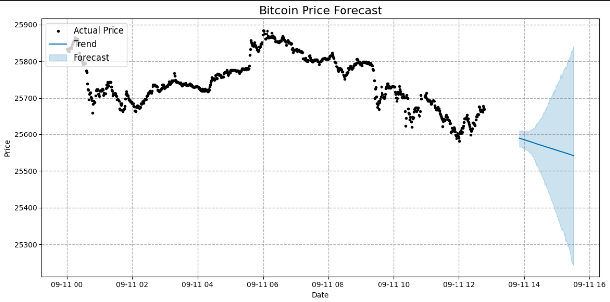

# Out-of-Sample Stock Price Prediction 



 This is a short example of how to predict stock prices out of sample using machine learning, using Facebook Prophet. 

**Disclaimer: This tutorial is for educational purposes only and should not be interpreted as trading advice. The provided code, timestamps, and datasets are used for visualization and experimentation purposes and may not represent a realistic trading model.**

By following the steps below, you'll be able to understand the code and get started with your price prediction project.

## Installation

To begin, you'll need to install the Prophet library. You can find installation instructions for Prophet in the official documentation [here](https://facebook.github.io/prophet/docs/installation.html#python).

Once you have Prophet installed (assuming you have an IDE), you're ready to get started!

## Quick Start

Prophet provides a quick start guide that will help you familiarize yourself with its Python API. I recommend reading through the quick start guide and trying out the provided code examples. You can find the guide [here](https://facebook.github.io/prophet/docs/quick_start.html#python-api).

## Understanding the Code
Once you have done the quick start, have a look at [the code](py_example.py) and [the sketch](sketch.png). In this example, Yahoo Finance is used as a dataset for price prediction. You can easily install the `yfinance` library, which provides a convenient way to access Yahoo Finance data, using pip:

```bash
#This is before you run the code
# Install yfinance for Yahoo Finance data
pip install yfinance 
# Install prophet to forecasting time series data
python -m pip install prophet
# For working with the datasets
pip install pandas
# Import matplotlib for plotting
import matplotlib.pyplot as plt
--------------------------------------------
#Code from py_example.py
import pandas as pd
from prophet import Prophet
import yfinance as yf
from datetime import datetime, timedelta
import matplotlib.pyplot as plt  # Import matplotlib for plotting

# Define the date and time for which you want to make predictions (current date and time)
now = datetime.now()

# Calculate the end time for predictions (100 minutes from now)
end_time = now + timedelta(minutes=100)

# Create a list of timestamps for the next 100 minutes at 1-minute intervals
timestamps = pd.date_range(start=now, end=end_time, freq='1T')

# Create a DataFrame with the timestamps
future = pd.DataFrame({'ds': timestamps})

# Download historical data for Bitcoin (adjust as needed)
data = yf.download('BTC-USD', period='1d', interval='1m')  # 1 day of 1-minute data for Bitcoin

# Prepare data for Prophet
data = data.reset_index()  # Reset the index to access the 'ds' and 'y' columns
data = data[['Datetime', 'Close']]  # Keep only 'Datetime' and 'Close' columns
data.rename(columns={'Datetime': 'ds', 'Close': 'y'}, inplace=True)  # Rename columns to 'ds' and 'y'
data['ds'] = data['ds'].dt.tz_localize(None)

# Create and fit the Prophet model
model = Prophet()
model.fit(data)

# Make predictions
forecast = model.predict(future)

# Visualize the forecast with custom settings
fig = model.plot(forecast, xlabel='Date', ylabel='Price', figsize=(12, 6))
plt.title('Bitcoin Price Forecast', fontsize=16)  # Update the title
plt.grid(True, linestyle='--', alpha=0.6)
plt.legend(['Actual Price', 'Trend', 'Forecast', 'Uncertainty'], loc='upper left', fontsize=12)
plt.tight_layout()
plt.show()

# Access the forecasted values
forecasted_values = forecast[['ds', 'yhat', 'yhat_lower', 'yhat_upper']]
print(forecasted_values)


